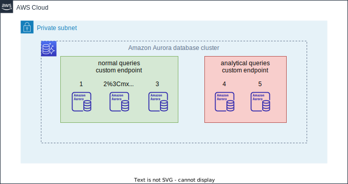

# AWS CDK Database Cluster Endpoint Construct Library

A construct library for creating custom endpoints for Amazon Aurora with the AWS CDK.

## Install

Install the `aws-cdk-database-cluster-endpoint` through npm:

```shell
npm install aws-cdk-database-cluster-endpoint
```

## Getting Started

Define an all instances target custom endpoint.

```ts
import * as rds from 'aws-cdk-lib/aws-rds';
declare const cluster: rds.IDatabaseCluster;
const customEndpoint = new DatabaseClusterEndpoint(cluster, 'CustomEndpoint', {
  cluster,
});
```

## Endpoint type

By default, DatabaseClusterEndpoint makes both reader and writer instances part of the custom endpoint.  
To target reader instances only, set `endpointType` to `DatabaseClusterEndpointType.READER`.

```ts
import * as rds from 'aws-cdk-lib/aws-rds';
declare const cluster: rds.IDatabaseCluster;
const customEndpoint = new DatabaseClusterEndpoint(cluster, 'CustomEndpoint', {
  cluster,
  endpointType: DatabaseClusterEndpointType.READER,
});
```

## Specify instances

By default, `DatabaseClusterEndpoint` sets all instances to the custom endpoint group.
To specify which instances are set to a custom endpoint group, set `members`.

The following example sets the 0th and 1st instances of the instances defined by `rds.DatabaseCluster` to the custom endpoint group.

```ts
import * as rds from 'aws-cdk-lib/aws-rds';
declare const cluster: rds.DatabaseCluster;
const customEndpoint = new DatabaseClusterEndpoint(cluster, 'CustomEndpoint', {
  cluster,
  members: DatabaseClusterEndpointMember.include([
    cluster.instanceIdentifiers[0],
    cluster.instanceIdentifiers[1],
  ]),
});
```

Conversely, use `DatabaseClusterEndpointMember.exclude` if you do not want to include the 0th. In this case, any new instances added in the future will also be set to a group of custom endpoints.

```ts
import * as rds from 'aws-cdk-lib/aws-rds';
declare const cluster: rds.DatabaseCluster;
const customEndpoint = new DatabaseClusterEndpoint(cluster, 'CustomEndpoint', {
  cluster,
  members: DatabaseClusterEndpointMember.exclude([
    cluster.instanceIdentifiers[0],
  ]),
});
```

## Connecting

The endpoints to access your custom endpoint will be available as the `.endpoint` attributes:

```ts
declare const customEndpoint: DatabaseClusterEndpoint;
new NodejsFunction(this, 'Application', {
  vpc,
  environment: {
    DATABASE_ENDPOINT: customEndpoint.endpoint.socketAddress, // "HOSTNAME:PORT"
  },
});
```

## Example

In this example, there is a analytical workload running analytical queries and
to avoid affecting the three instances running normal queries,
two instances dedicated to analytical queries are set up and connected using custom endpoints.

The 4th and 5th instances created are the instances dedicated to the analytical queries,
while the other instances are the instances that perform the normal queries.
An example of creating each read-only custom endpoint follows.



### Use Current DatabaseCluster

This is an example using the current `rds.DatabaseClusrer` definition method. Recommend this pattern.

```ts
import * as cdk from 'aws-cdk-lib';
import * as ec2 from 'aws-cdk-lib/aws-ec2';
import * as rds from 'aws-cdk-lib/aws-rds';

const app = new cdk.App();
const stack = new cdk.Stack(app, 'DatabaseClusterEndpointStack');

const vpc = new ec2.Vpc(stack, 'Vpc', {
  natGateways: 0,
});

const cluster = new rds.DatabaseCluster(stack, 'DatabaseCluster', {
  vpc,
  engine: rds.DatabaseClusterEngine.auroraMysql({
    version: rds.AuroraMysqlEngineVersion.VER_3_10_2,
  }),
  writer: rds.ClusterInstance.provisioned('Writer'),
  readers: [
    rds.ClusterInstance.provisioned('Reader1'),
    rds.ClusterInstance.provisioned('Reader2'),
    rds.ClusterInstance.provisioned('Analytics1', { promotionTier: 15 }),
    rds.ClusterInstance.provisioned('Analytics2', { promotionTier: 15 }),
  ],
  vpcSubnets: {
    subnetType: ec2.SubnetType.PRIVATE_ISOLATED,
  },
});

const findInstance = (id: string) =>
  cluster.node.findChild(id).node.defaultChild as rds.CfnDBInstance;

// Create endpoints for normal queris
new DatabaseClusterEndpoint(cluster, 'NormalQueryEndpoint', {
  cluster,
  endpointType: DatabaseClusterEndpointType.READER,
  members: DatabaseClusterEndpointMember.exclude([
    findInstance('Writer').ref,
    findInstance('Reader1').ref,
    findInstance('Reader2').ref,
  ]),
});

// Create endpoints for analytical queris
new DatabaseClusterEndpoint(cluster, 'AnalyticalQueryEndpoint', {
  cluster,
  endpointType: DatabaseClusterEndpointType.READER,
  members: DatabaseClusterEndpointMember.include([
    findInstance('Analytics1').ref,
    findInstance('Analytics2').ref,
  ]),
});
```

### Use Legacy DatabaseClusrer

This is an example using the legacy `rds.DatabaseClusrer` definition method.

```ts
import * as cdk from 'aws-cdk-lib';
import * as ec2 from 'aws-cdk-lib/aws-ec2';
import * as rds from 'aws-cdk-lib/aws-rds';

const app = new cdk.App();
const stack = new cdk.Stack(app, 'DatabaseClusterEndpointStack');

const vpc = new ec2.Vpc(stack, 'Vpc', {
  natGateways: 0,
});
const cluster = new rds.DatabaseCluster(vpc, 'DatabaseCluster', {
  engine: rds.DatabaseClusterEngine.auroraMysql({
    version: rds.AuroraMysqlEngineVersion.VER_3_07_0,
  }),
  instanceProps: {
    vpc,
    vpcSubnets: {
      subnetType: ec2.SubnetType.PRIVATE_ISOLATED,
    },
  },
  instances: 5,
});

// DatabaseCluster creates resources with an ID of "Instance{index}",
// so get these from the cluster. (Indexes start from 1.)
const instances = cluster.instanceIdentifiers.map(
  (_, index) =>
    cluster.node.findChild(`Instance${index + 1}`) as rds.CfnDBInstance
);

// Filters only the 4th and 5th instances for analytical. (Indexes start from 0.)
const analyticalQueryInstances = instances.filter((_, index) =>
  [3, 4].includes(index)
);
const normalQueryInstances = instances.filter(
  (_, index) => ![3, 4].includes(index)
);

/**
 * [Optional]
 * Set a low priority to prevent this Aurora Replicas from being promoted
 * to the primary instance in the event of a failure of the existing primary instance.
 */
analyticalQueryInstances.forEach((analytical) => {
  analytical.addPropertyOverride('PromotionTier', 15);
  normalQueryInstances.forEach((normal) => analytical.addDependency(normal));
});

// Create endpoints for analytical queris
new DatabaseClusterEndpoint(cluster, 'AnalyticalQueryEndpoint', {
  cluster,
  endpointType: DatabaseClusterEndpointType.READER,
  members: DatabaseClusterEndpointMember.include(
    analyticalQueryInstances.map((instance) => instance.ref)
  ),
});

// Create endpoints for normal queris
new DatabaseClusterEndpoint(cluster, 'NormalQueryEndpoint', {
  cluster,
  endpointType: DatabaseClusterEndpointType.READER,
  members: DatabaseClusterEndpointMember.exclude(
    analyticalQueryInstances.map((instance) => instance.ref)
  ),
});
```
